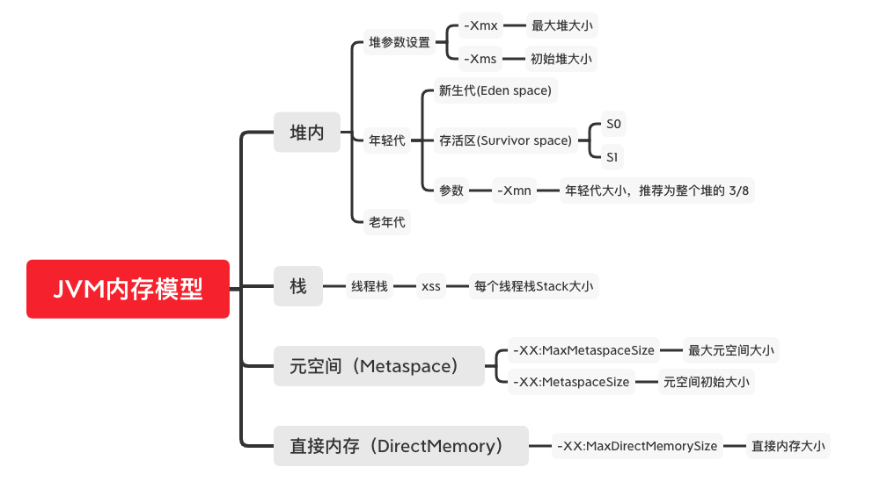
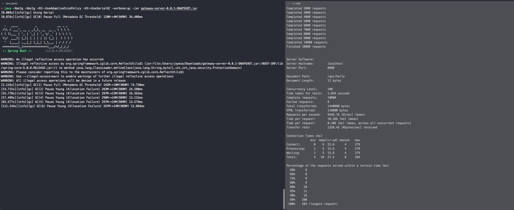
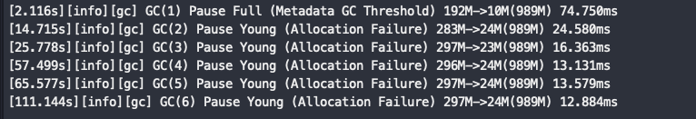
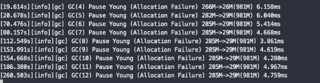
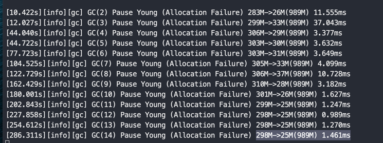
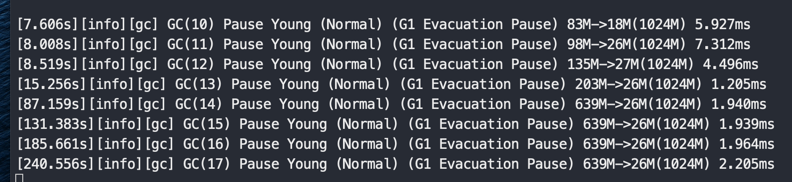

### 第一课作业
1. 自己写一个简单的Hello.java，里面需要涉及基本类型，四则运算，if和for，然后自己分析一下对应的字节码

原文件见 src/task1/Hello.class

进入src目录

使用 javac 编译 `javac -g task1/Hello.java `

使用 javap 反编译 `javap -c -v task1.Hello`

得到以下字节码文件，注释写在 // 右侧

```text
Classfile /Users/jaymie/study/learn-java/JAVA-01/Week_01/src/task1/Hello.class // 从下一行开始的7行都是字节码文件信息
  Last modified 2021-1-9; size 901 bytes
  MD5 checksum 13c95fb96723e61efb2a2f4df116b49d
  Compiled from "Hello.java"
public class task1.Hello
  minor version: 0
  major version: 52
  flags: ACC_PUBLIC, ACC_SUPER
Constant pool:  // 常量池
   #1 = Methodref          #6.#33         // java/lang/Object."<init>":()V
   #2 = Fieldref           #34.#35        // java/lang/System.out:Ljava/io/PrintStream;
   #3 = Methodref          #36.#37        // java/io/PrintStream.println:(I)V
   #4 = Fieldref           #5.#38         // task1/Hello.datas:[I
   #5 = Class              #39            // task1/Hello
   #6 = Class              #40            // java/lang/Object
   #7 = Utf8               datas
   #8 = Utf8               [I
   #9 = Utf8               <init>
  #10 = Utf8               ()V
  #11 = Utf8               Code
  #12 = Utf8               LineNumberTable
  #13 = Utf8               LocalVariableTable
  #14 = Utf8               this
  #15 = Utf8               Ltask1/Hello;
  #16 = Utf8               main
  #17 = Utf8               ([Ljava/lang/String;)V
  #18 = Utf8               num
  #19 = Utf8               I
  #20 = Utf8               args
  #21 = Utf8               [Ljava/lang/String;
  #22 = Utf8               a
  #23 = Utf8               b
  #24 = Utf8               c
  #25 = Utf8               max
  #26 = Utf8               sum
  #27 = Utf8               StackMapTable
  #28 = Class              #21            // "[Ljava/lang/String;"
  #29 = Class              #8             // "[I"
  #30 = Utf8               <clinit>
  #31 = Utf8               SourceFile
  #32 = Utf8               Hello.java
  #33 = NameAndType        #9:#10         // "<init>":()V
  #34 = Class              #41            // java/lang/System
  #35 = NameAndType        #42:#43        // out:Ljava/io/PrintStream;
  #36 = Class              #44            // java/io/PrintStream
  #37 = NameAndType        #45:#46        // println:(I)V
  #38 = NameAndType        #7:#8          // datas:[I
  #39 = Utf8               task1/Hello
  #40 = Utf8               java/lang/Object
  #41 = Utf8               java/lang/System
  #42 = Utf8               out
  #43 = Utf8               Ljava/io/PrintStream;
  #44 = Utf8               java/io/PrintStream
  #45 = Utf8               println
  #46 = Utf8               (I)V
{
  public task1.Hello();   // 构造方法
    descriptor: ()V
    flags: ACC_PUBLIC
    Code:
      stack=1, locals=1, args_size=1  // 最大操作栈1，局部变量表容量1，参数个数1
         0: aload_0                           // 将第一个引用类型本地变量推送至栈顶。对于非静态方法，this 会被分配到局部变量表的第0号槽位
         1: invokespecial #1                  // Method java/lang/Object."<init>":()V  使用了父类Object的构造方法
         4: return
      LineNumberTable:  // 源码和字节码行数对应关系
        line 6: 0
      LocalVariableTable:  // 局部变量表
        Start  Length  Slot  Name   Signature
            0       5     0  this   Ltask1/Hello;

  public static void main(java.lang.String[]);  // main方法
    descriptor: ([Ljava/lang/String;)V          // 方法描述，L为对象，入参为String类型的对象，V表示方法返回为void
    flags: ACC_PUBLIC, ACC_STATIC               // 方法的访问标志，public 与 static
    Code:
      stack=2, locals=10, args_size=1           // 最大操作栈2，局部变量表容量10，参数1
         0: iconst_1                            // 将常量 1 压入栈顶，（i表示 int类型的数据，当int取值-1~5时，JVM采用iconst指令将常量压入栈中)
         1: istore_1                            // pop 出栈顶的 int类型的值，即1，存入到局部变量表的 slot1 位置，即slot1的值为1
         2: sipush        200                   // 将常量200压入栈顶， (当int取值-32768~32767时，JVM采用sipush指令将常量压入栈中。)
         5: istore_2                            // 将栈顶的元素pop出，存入到局部变量的 slot2 位置，即slot2的值为200
         6: iload_1                             // 将局部变量表的slot1压入栈，即1
         7: iload_2                             // 将局部变量表的slot2压入栈，即200
         8: iadd                                // 将栈顶两个元素pop之后相加，结果压入栈顶，结果为201
         9: istore_3                            // pop出栈顶的值201，存入到局部变量表的slot3
        10: getstatic     #2                    // Field java/lang/System.out:Ljava/io/PrintStream; 获取静态成员PrintStream，压入栈顶（#2对应常量池）
        13: iload_3                             // 将局部变量表slot3的值压入栈，即201
        14: invokevirtual #3                    // Method java/io/PrintStream.println:(I)V 调用实例方法 pringln 执行打印操作（#3页对应常量池中的方法）
        17: iconst_0                            // 常量0压入栈，并且存入到局部变量表的slot4
        18: istore        4
        20: iload_1                             // 将局部变量表的slot1和slot2压入栈，即 1 和 200
        21: iload_2
        22: if_icmple     31                   // 进行比较 如何1小于等于200，那么到31行指令，该条件成立（可以发现他的比较和源码是反着的，并且这个比较操作原本压入栈顶的两个元素也会进行出栈操作，这样子栈就是空的了）
        25: iload_1
        26: istore        4
        28: goto          34
        31: iload_2                            // 往栈顶压入slot2的值即 200
        32: istore        4                    // 将 200 存入到 slot4，slot4需要存放的是比较之后较大的那个值
        34: getstatic     #2                  // Field java/lang/System.out:Ljava/io/PrintStream; 接下来和上面一样就行 slot4的值的打印操作
        37: iload         4
        39: invokevirtual #3                  // Method java/io/PrintStream.println:(I)V
        42: iconst_0                          // 常量0压入栈，并且存入到局部变量表的slot5, slot5需要最后存累加的结果
        43: istore        5                   
        45: getstatic     #4                  // Field datas:[I 从常量池活动 datas 数组的引用值（即#4），压入栈顶
        48: astore        6                   // 保存引用值到局部变量表的slot6，之后可以认为 slot6就是这个数组
        50: aload         6                   // 再次将数组压入到栈
        52: arraylength                       // 获取数组的长度，压入栈
        53: istore        7                   // 将栈顶的值存入到局部变量表的slot7，即数组的长度4，之后slot7可以认为是4
        55: iconst_0                          // 将常量0压入栈，然后出栈存入到slot8，可以认为是循环的临时变量 i
        56: istore        8                   
        58: iload         8                   // 将slot8，也就是i=0压入栈
        60: iload         7                   // 将slot7，也就是数组长度length=4压入栈
        62: if_icmpge     85                  // 进行比较，如果 0 >= 4 ，那么直接跳转到 85 行，显然不成立，则进入循环体内
        65: aload         6                   // 再次将 slot6 即数组的压入栈
        67: iload         8                   // 将slot8，也就是i=0压入栈
        69: iaload                            // 将int型数组指定索引的值推送至栈顶，就是将 datas[0] 压入栈，此时值为1
        70: istore        9                   // 出栈之后保存到临时变量表的 slot9 中，
        72: iload         5                   // slot5入栈，slot5为sum的值，此时为0
        74: iload         9                   // 再次把slot9入栈，为 datas[0]的值，此时为1，
        76: iadd                              // 栈顶两个元素相加，即 sum + datas[0], 得到的结果再次保存到 slot5中                 
        77: istore        5
        79: iinc          8, 1                // 将局部变量表的 slot8 也就是循环的临时表 i 进行 +1 操作，此时等于1
        82: goto          58                  // 跳转到 58 行继续循环逻辑
        85: getstatic     #2                  // Field java/lang/System.out:Ljava/io/PrintStream; // 最后将slot5也就是sum的值进行pring输出
        88: iload         5
        90: invokevirtual #3                  // Method java/io/PrintStream.println:(I)V
        93: return
      LineNumberTable:   // 源码和字节码行数对应关系
        line 10: 0
        line 11: 2
        line 12: 6
        line 13: 10
        line 16: 17
        line 17: 20
        line 18: 25
        line 20: 31
        line 22: 34
        line 25: 42
        line 26: 45
        line 27: 72
        line 26: 79
        line 29: 85
        line 31: 93
      LocalVariableTable:   // 局部变量表
        Start  Length  Slot  Name   Signature
           72       7     9   num   I                    // slot9 存的是 num，也就是 datas[i]
            0      94     0  args   [Ljava/lang/String;  // slot0为该方法的入参
            2      92     1     a   I                    // slot1 为a的值
            6      88     2     b   I                    // slot2 为b的值
           10      84     3     c   I                    // slot3 为c的值
           20      74     4   max   I                    // slot4 为max
           45      49     5   sum   I                    // slot5 为sum
           // 之前可以看到局部变量表容量10，那么现在还缺少3个slot，slot6 保存了 datas 数组的引用值， slot7 数组的长度, slot8 循环的临时变量i
      StackMapTable: number_of_entries = 4
        frame_type = 255 /* full_frame */
          offset_delta = 31
          locals = [ class "[Ljava/lang/String;", int, int, int, int ]
          stack = []
        frame_type = 2 /* same */
        frame_type = 255 /* full_frame */
          offset_delta = 23
          locals = [ class "[Ljava/lang/String;", int, int, int, int, int, class "[I", int, int ]
          stack = []
        frame_type = 248 /* chop */
          offset_delta = 26

  static {};   // 初始化静态成员变量 datas 的逻辑
    descriptor: ()V
    flags: ACC_STATIC
    Code:
      stack=4, locals=0, args_size=0
         0: iconst_4
         1: newarray       int
         3: dup
         4: iconst_0
         5: iconst_1
         6: iastore
         7: dup
         8: iconst_1
         9: iconst_2
        10: iastore
        11: dup
        12: iconst_2
        13: bipush        10
        15: iastore
        16: dup
        17: iconst_3
        18: sipush        200
        21: iastore
        22: putstatic     #4                  // Field datas:[I
        25: return
      LineNumberTable:
        line 7: 0
}
SourceFile: "Hello.java"


```

2. 自定义一个 Classloader，加载一个Hello.xlass 文件，执行 hello 方法，此文件内容是一个 Hello.class 文件所有字节(x=255-x) 处理后的文件

详见 /srce/task2 中的部分代码

3. 画一张图，展示 Xmx， Xms，Xmn，Metaspace，DirectMemory，Xss 这些内存参数的关系




4. 检查一下自己维护的业务系统的 JVM 参数配置，用 jstat 和 jstack，jmap 查看下详情，并且自己独立分析一下大概情况，思考有没有不合理的地方，如何改机
    * 对于线上有流量的系统，慎重使用jmap命令
    * 如果没有线上系统，可以自己 run 一个 web/java 项目，或者查看idea进程
   

### 第二课作业

1.（选做）本机使用 G1 GC 启动一个程序，仿照课上案例分析一下 JVM 情况。
可以使用 gateway-server-0.0.1-SNAPSHOT.jar 注意关闭自适应参数:-XX:-UseAdaptiveSizePolicy

#### 实验环境：
macos，jdk11.0.6

#### 实验1
首先不加任何jvm参数运行

`java -jar gateway-server-0.0.1-SNAPSHOT.jar`

使用`jinfo`查看jvm参数设置

```text
VM Flags:
-XX:CICompilerCount=4 
-XX:ConcGCThreads=3 
-XX:G1ConcRefinementThreads=10 
-XX:G1HeapRegionSize=2097152 
-XX:GCDrainStackTargetSize=64 
-XX:InitialHeapSize=536870912 
-XX:MarkStackSize=4194304 
-XX:MaxHeapSize=8589934592 
-XX:MaxNewSize=5152702464 
-XX:MinHeapDeltaBytes=2097152 
-XX:NonNMethodCodeHeapSize=5836300 
-XX:NonProfiledCodeHeapSize=122910970 
-XX:ProfiledCodeHeapSize=122910970 
-XX:ReservedCodeCacheSize=251658240 
-XX:+SegmentedCodeCache 
-XX:+UseCompressedClassPointers 
-XX:+UseCompressedOops 
-XX:+UseG1GC  //可以看到默认的GC策略是G1GC
```

使用`jmap`查看堆内存情况  `jhsdb jmap --heap --pid 42721`

```text
Heap Configuration:
   MinHeapFreeRatio         = 40
   MaxHeapFreeRatio         = 70
   MaxHeapSize              = 8589934592 (8192.0MB)  //最大堆内存正好8G
   NewSize                  = 1363144 (1.2999954223632812MB)  // 初始young区内存
   MaxNewSize               = 5152702464 (4914.0MB)           // 最大young去内存 4.78G
   OldSize                  = 5452592 (5.1999969482421875MB)  // 初始old区内存
   NewRatio                 = 2                               // 年轻代与老年代在堆结构的占比为2，即eden:old为1:2，所以占整个堆内存的1/3          
   SurvivorRatio            = 8                               // survivor区和eden区的比例，1:8,即s占整个yong的 1/9
   MetaspaceSize            = 21807104 (20.796875MB)         // Metaspace初始大小
   CompressedClassSpaceSize = 1073741824 (1024.0MB)
   MaxMetaspaceSize         = 17592186044415 MB             // Metaspace可以认为没有上限
   G1HeapRegionSize         = 2097152 (2.0MB)

Heap Usage:
G1 Heap:
   regions  = 4096
   capacity = 8589934592 (8192.0MB)
   used     = 153717504 (146.596435546875MB)
   free     = 8436217088 (8045.403564453125MB)
   1.789507269859314% used
G1 Young Generation:
Eden Space:
   regions  = 67
   capacity = 161480704 (154.0MB)
   used     = 140509184 (134.0MB)
   free     = 20971520 (20.0MB)
   87.01298701298701% used
Survivor Space:
   regions  = 7
   capacity = 14680064 (14.0MB)
   used     = 14680064 (14.0MB)
   free     = 0 (0.0MB)
   100.0% used
G1 Old Generation:
   regions  = 0
   capacity = 360710144 (344.0MB)
   used     = 0 (0.0MB)
   free     = 360710144 (344.0MB)
   0.0% used
```

上面参数可以知道，JDK11的默认GC是`G1GC`，另外我的物理机是32G，但是他设置的最大堆内存为8G。最大Young区的内存是最大堆内存的 4.78个G，不知道怎么计算的

#### 实验2
指定串行GC `java -Xmx1g -Xms1g -XX:-UseAdaptiveSizePolicy -XX:+UseSerialGC -jar gateway-server-0.0.1-SNAPSHOT.jar`

使用jinfo，`jinfo -flags 45972`

```text
-XX:CICompilerCount=4 
-XX:InitialHeapSize=1073741824  // 初始堆内存 1024M, 1G
-XX:MaxHeapSize=1073741824      // 最大堆内存 1024M, 1G
-XX:MaxNewSize=357892096        // 最大young区，341.3125M，正好占比1/3
-XX:NewSize=357892096           // 初始的young区，也是 341.3125M
-XX:OldSize=715849728           // 初始old区，682.6875M，剩下1/3
-XX:MinHeapDeltaBytes=196608    // 堆内存每次扩充的最小值 192.0M
-XX:NonNMethodCodeHeapSize=5836300 
-XX:NonProfiledCodeHeapSize=122910970 
-XX:ProfiledCodeHeapSize=122910970 
-XX:ReservedCodeCacheSize=251658240 
-XX:+SegmentedCodeCache 
-XX:-UseAdaptiveSizePolicy 
-XX:+UseCompressedClassPointers 
-XX:+UseCompressedOops 
-XX:+UseSerialGC   // 使用了指定的 SerialGC 
```

使用 `jhsdb jmap --heap --pid 45972`
```text
Heap Configuration:
   MinHeapFreeRatio         = 40
   MaxHeapFreeRatio         = 70
   MaxHeapSize              = 1073741824 (1024.0MB) // 这部分的数据与上面的参数配置是一致的
   NewSize                  = 357892096 (341.3125MB)
   MaxNewSize               = 357892096 (341.3125MB)
   OldSize                  = 715849728 (682.6875MB)
   NewRatio                 = 2     // old和new的占比2:1
   SurvivorRatio            = 8     // eden 和 s区的占比 8:1
   MetaspaceSize            = 21807104 (20.796875MB)
   CompressedClassSpaceSize = 1073741824 (1024.0MB)
   MaxMetaspaceSize         = 17592186044415 MB
   G1HeapRegionSize         = 0 (0.0MB)

Heap Usage:
New Generation (Eden + 1 Survivor Space):
   capacity = 322109440 (307.1875MB)
   used     = 176755912 (168.56757354736328MB)
   free     = 145353528 (138.61992645263672MB)
   54.87448986282426% used
Eden Space:        // 这里可以看到，Eden区的容量 / From Space的容量，正好是 8:1
   capacity = 286326784 (273.0625MB)
   used     = 176755912 (168.56757354736328MB)
   free     = 109570872 (104.49492645263672MB)
   61.73223109997282% used
From Space:
   capacity = 35782656 (34.125MB)
   used     = 0 (0.0MB)
   free     = 35782656 (34.125MB)
   0.0% used
To Space:
   capacity = 35782656 (34.125MB)
   used     = 0 (0.0MB)
   free     = 35782656 (34.125MB)
   0.0% used
tenured generation:
   capacity = 715849728 (682.6875MB)
   used     = 11405416 (10.877052307128906MB)
   free     = 704444312 (671.8104476928711MB)
   1.593269586323011% used
```

#### 实验3
使用并行GC `java -Xmx1g -Xms1g -XX:-UseAdaptiveSizePolicy -XX:+UseParallelGC -jar gateway-server-0.0.1-SNAPSHOT.jar`


`jinfo -flags 46494`
```text
-XX:CICompilerCount=4 
-XX:InitialHeapSize=1073741824 
-XX:MaxHeapSize=1073741824 
-XX:MaxNewSize=357564416 
-XX:MinHeapDeltaBytes=524288 
-XX:NewSize=357564416 
-XX:NonNMethodCodeHeapSize=5836300 
-XX:NonProfiledCodeHeapSize=122910970 
-XX:OldSize=716177408 
-XX:ProfiledCodeHeapSize=122910970 
-XX:ReservedCodeCacheSize=251658240 
-XX:+SegmentedCodeCache 
-XX:-UseAdaptiveSizePolicy 
-XX:+UseCompressedClassPointers 
-XX:+UseCompressedOops 
-XX:+UseParallelGC
```

`jhsdb jmap --heap --pid 46494`

```text
Heap Configuration:
   MinHeapFreeRatio         = 40
   MaxHeapFreeRatio         = 70
   MaxHeapSize              = 1073741824 (1024.0MB)
   NewSize                  = 357564416 (341.0MB)
   MaxNewSize               = 357564416 (341.0MB)
   OldSize                  = 716177408 (683.0MB)
   NewRatio                 = 2
   SurvivorRatio            = 8
   MetaspaceSize            = 21807104 (20.796875MB)
   CompressedClassSpaceSize = 1073741824 (1024.0MB)
   MaxMetaspaceSize         = 17592186044415 MB
   G1HeapRegionSize         = 0 (0.0MB)

Heap Usage:
PS Young Generation
Eden Space:
   capacity = 268435456 (256.0MB)
   used     = 171112448 (163.185546875MB)
   free     = 97323008 (92.814453125MB)
   63.744354248046875% used
From Space:
   capacity = 44564480 (42.5MB)
   used     = 0 (0.0MB)
   free     = 44564480 (42.5MB)
   0.0% used
To Space:
   capacity = 44564480 (42.5MB)
   used     = 0 (0.0MB)
   free     = 44564480 (42.5MB)
   0.0% used
PS Old Generation
   capacity = 716177408 (683.0MB)
   used     = 11028304 (10.517410278320312MB)
   free     = 705149104 (672.4825897216797MB)
   1.539884374571056% used
```

内存使用上的的设置看起来跟串行GC没有区别

#### 实验四

使用CMSGC `java -Xmx1g -Xms1g -XX:-UseAdaptiveSizePolicy -XX:+UseConcMarkSweepGC -jar gateway-server-0.0.1-SNAPSHOT.jar`

`jinfo`查看jvm参数

```text
-XX:CICompilerCount=4 
-XX:InitialHeapSize=1073741824 
-XX:MaxHeapSize=1073741824 
-XX:MaxNewSize=357892096
-XX:MaxTenuringThreshold=6 
-XX:MinHeapDeltaBytes=196608 
-XX:NewSize=357892096 
-XX:NonNMethodCodeHeapSize=5836300 
-XX:NonProfiledCodeHeapSize=122910970 
-XX:OldSize=715849728 
-XX:ProfiledCodeHeapSize=122910970 
-XX:ReservedCodeCacheSize=251658240 
-XX:+SegmentedCodeCache 
-XX:-UseAdaptiveSizePolicy 
-XX:+UseCompressedClassPointers 
-XX:+UseCompressedOops 
-XX:+UseConcMarkSweepGC // 使用CMS GC 策略
```

`jmap`查看内存

```text
using thread-local object allocation.
Concurrent Mark-Sweep GC

Heap Configuration:
   MinHeapFreeRatio         = 40
   MaxHeapFreeRatio         = 70
   MaxHeapSize              = 1073741824 (1024.0MB)
   NewSize                  = 357892096 (341.3125MB)
   MaxNewSize               = 357892096 (341.3125MB)
   OldSize                  = 715849728 (682.6875MB)
   NewRatio                 = 2
   SurvivorRatio            = 8
   MetaspaceSize            = 21807104 (20.796875MB)
   CompressedClassSpaceSize = 1073741824 (1024.0MB)
   MaxMetaspaceSize         = 17592186044415 MB
   G1HeapRegionSize         = 0 (0.0MB)

Heap Usage:
New Generation (Eden + 1 Survivor Space):
   capacity = 322109440 (307.1875MB)
   used     = 223130336 (212.79367065429688MB)
   free     = 98979104 (94.39382934570312MB)
   69.27159166772636% used
Eden Space:
   capacity = 286326784 (273.0625MB)
   used     = 212477608 (202.63443756103516MB)
   free     = 73849176 (70.42806243896484MB)
   74.20807967444638% used
From Space:
   capacity = 35782656 (34.125MB)
   used     = 10652728 (10.159233093261719MB)
   free     = 25129928 (23.96576690673828MB)
   29.77064642714057% used
To Space:
   capacity = 35782656 (34.125MB)
   used     = 0 (0.0MB)
   free     = 35782656 (34.125MB)
   0.0% used
concurrent mark-sweep generation:
   capacity = 715849728 (682.6875MB)
   used     = 0 (0.0MB)
   free     = 715849728 (682.6875MB)
   0.0% used
```

内存分配上和并行以及串行上都一样看起来


上述实验，当jvm的 -Xmx1g -Xms1g 参数都一样的时候，除了G1 GC，其他GC，串行，并行以及cms，他们的堆空间分配是完全一样的


### 进行GC和压测实验
实验说明，我们使用apache ab进行压力测试，请求1000次，并发100，看GC情况，以及受到影响的一些性能指标，主要保证1000次请求中一定触发了一次YoungGC

#### 实验一，JIT特性对结果的影响
jvm存在JIT特性，可以对比刚开始的情况和多次压测之后的情况，使用串行GC测试
串行GC `java -Xmx1g -Xms1g -XX:-UseAdaptiveSizePolicy -XX:+UseSerialGC -verbose:gc -jar gateway-server-0.0.1-SNAPSHOT.jar`



上图所示，进行了多次测试，第一次FullGC是程序启动时导致的，不用关注，剩下几次均为YoungGC，每执行一次均会触发 YoungGC

首先可以观察到的是每次GC差不多都是从 297M -> 24M，但是GC的耗时在不断的减少，不知道为什么。

然后看压测结果,选两组进行观看
```text
# 第一次测试
Time per request:       13.667 [ms] (mean)  // 每100次并发请求的平均响应时间
Time per request:       0.137 [ms] (mean, across all concurrent requests) // 每个请求的响应平均时间

  50%     11
  66%     12
  75%     13
  80%     14
  90%     18
  95%     21
  98%     43
  99%     50    // 99线，即99%的请求都可以在50ms内返回
 100%    116 (longest request)

# 最后一次测试
Time per request:       6.402 [ms] (mean)
Time per request:       0.064 [ms] (mean, across all concurrent requests)

Percentage of the requests served within a certain time (ms)
  50%      6
  66%      7
  75%      8
  80%      8
  90%      8
  95%      9
  98%      9
  99%     14  // 只要14ms
 100%     16 (longest request)
```

可以看出时间明显小了一半，这依赖于JVM的JIT特性，即当某一个方法执行次数过多时，jvm就会把他编译成机器码保存起来，这样子执行会更快

#### 实验2 不同GC策略
主要对比以下几个指标，并且都经过了预热
* 垃圾回收的时间
* 接口平均响应时间
* 99线的响应时间

串行GC `java -Xmx1g -Xms1g -XX:-UseAdaptiveSizePolicy -XX:+UseSerialGC -verbose:gc -jar gateway-server-0.0.1-SNAPSHOT.jar`
并行GC `java -Xmx1g -Xms1g -XX:-UseAdaptiveSizePolicy -XX:+UseParallelGC -verbose:gc -jar gateway-server-0.0.1-SNAPSHOT.jar`
使用CMSGC `java -Xmx1g -Xms1g -XX:-UseAdaptiveSizePolicy -XX:+UseConcMarkSweepGC -verbose:gc -jar gateway-server-0.0.1-SNAPSHOT.jar`
使用G1 `java -Xmx1g -Xms1g -XX:-UseAdaptiveSizePolicy -XX:+UseG1GC -XX:MaxGCPauseMillis=50 -verbose:gc -jar gateway-server-0.0.1-SNAPSHOT.jar`


##### 对比GC时间
```text
# 串行GC
285M->29M(989M)  13.13ms

# 并行GC
285M->29M(981M) 4.280ms

# CMS
298M->25M(989M) 1.461ms

# G1
639M->26M(1024M) 1.964ms
```

从垃圾回收的速度来看，表现排名，CMS > G1 > 并行GC > 串行GC

截图如下

**串行GC**


**并行GC**


**CMS GC**


**G1**



##### 对比平均响应时间
```text
# 串行GC 
Time per request:       6.402 [ms] (mean) // 100次并发请求的响应时间
Time per request:       0.064 [ms] (mean, across all concurrent requests)

// 并行gc
Time per request:       6.745 [ms] (mean)
Time per request:       0.067 [ms] (mean, across all concurrent requests)

// CMS
Time per request:       16.568 [ms] (mean)
Time per request:       0.166 [ms] (mean, across all concurrent requests)

// G1
Time per request:       14.553 [ms] (mean)
Time per request:       0.146 [ms] (mean, across all concurrent requests
```

从平均响应时间的表现来看
串行GC > 并行GC > G1 > CMS


#### 99线
```text
# 串行GC 预热后的表现
99%     14  

# 并行GC
99%     11

# CMS
99%      8

# G1
99%     11
```

从99线表现来看
CMS > G1 ≈ 并行 > 串行


最终结论
1. GC速度越慢的算法，他的平均响应时间越快？这是为什么被平均了？
2. GC速度越快的算法，吞吐量越好，因为99线比较低

